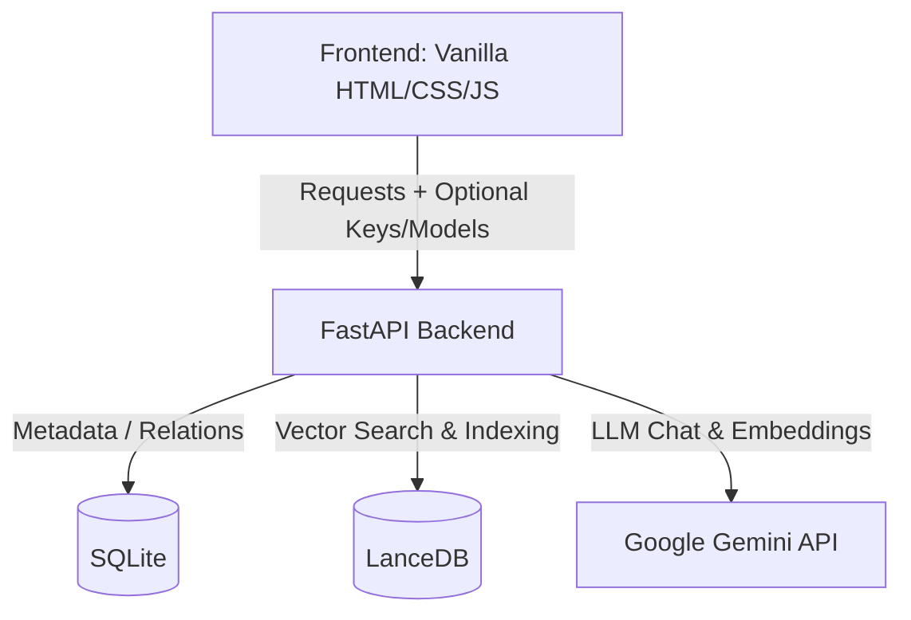

# 🧠 Second Brain OS — Architecture & Code Explanation

This document provides a detailed breakdown of the codebase, project architecture, and data flows of **Second Brain OS**.

---

## 1. System Overview

Second Brain OS is a lightweight, local-first **RAG (Retrieval-Augmented Generation)** knowledge system. It combines structured storage (SQLite) with semantic vector storage (LanceDB) and uses the **Google Gemini API** for generating document embeddings and streaming conversational responses.



---

## 2. Backend Components

The backend is built with **FastAPI** and divided into routers (API controllers), database models, and service classes.

### A. Configurations & Database
* **[`backend/app/config.py`](file:///d:/projects/second-brain-os/backend/app/config.py)**: Loads configuration settings from the `.env` file using `pydantic-settings`. Default parameters specify:
  - `LLM_MODEL`: `gemini-2.5-flash`
  - `EMBEDDING_MODEL`: `gemini-embedding-2`
  - `GEMINI_EMBEDDING_DIMENSION`: `768` (configured target dimensionality)
* **[`backend/app/database/db.py`](file:///d:/projects/second-brain-os/backend/app/database/db.py)**: Initializes the SQLAlchemy session pool pointing to the SQLite database `second_brain.db`.
* **[`backend/app/database/models.py`](file:///d:/projects/second-brain-os/backend/app/database/models.py)**: Defines three primary relational tables:
  1. `Note`: Stores notes and uploaded documents metadata (such as titles, physical file paths, file types, and contents).
  2. `NoteLink`: Represents wiki-style bi-directional note links (`[[wiki-link]]`).
  3. `ChatSession` & `ChatMessage`: Manages chat session history and sources.

---

### B. Routers (API Endpoints)
* **[`backend/app/routers/notes.py`](file:///d:/projects/second-brain-os/backend/app/routers/notes.py)**:
  - Handles CRUD operations for standard text notes.
  - Implements **`parse_and_update_links()`** to scan note content for Obsidian-style double brackets (`[[Note Title]]`) and dynamically create relationships in the `NoteLink` table.
* **[`backend/app/routers/documents.py`](file:///d:/projects/second-brain-os/backend/app/routers/documents.py)**:
  - Exposes `POST /api/v1/documents/upload` to upload PDFs, Markdowns, and text files.
  - Offloads computationally expensive text parsing and embedding generation to a **non-blocking background task** (`_index_document_bg`) so the HTTP response is returned immediately to prevent browser timeouts.
* **[`backend/app/routers/chat.py`](file:///d:/projects/second-brain-os/backend/app/routers/chat.py)**:
  - Creates and manages chat conversation sessions.
  - Streams LLM responses to the frontend using FastAPI's `StreamingResponse`.

---

### C. Core Services
* **[`backend/app/services/document_parser.py`](file:///d:/projects/second-brain-os/backend/app/services/document_parser.py)**:
  - Uses `PyMuPDF` (via `pymupdf`) to extract raw text content from PDF pages.
  - Cleans up carriage returns, double-whitespaces, and formatting artifacts to optimize content for LLM ingestion.
* **[`backend/app/services/vector_db.py`](file:///d:/projects/second-brain-os/backend/app/services/vector_db.py)**:
  - Manages **LanceDB** vector storage (`document_chunks` table).
  - Caches Gemini client instances using `get_client(api_key)` to avoid the overhead of recreating clients for every request.
  - Implements `get_embeddings_batch()`, which chunk-slices list inputs into blocks of **at most 100 texts** to respect the Gemini API maximum batch size.
  - Implements auto-recreation on dimension mismatch in `init_vector_db()` (useful when changing vector dimensions).
* **[`backend/app/services/rag_service.py`](file:///d:/projects/second-brain-os/backend/app/services/rag_service.py)**:
  - Implements recursive overlapping chunk split logic (`chunk_text()`) to prepare documents for embedding.
  - Combines relevant context search hits with conversation history into a structured system prompt (`build_rag_prompt()`).
  - Calls `generate_content_stream()` to yield response tokens.

---

## 3. Frontend Components

The frontend is a lightweight single-page application built with **Vanilla HTML/CSS/JS** located in `backend/static/`.

* **[`backend/static/index.html`](file:///d:/projects/second-brain-os/backend/static/index.html)**: Provides a split-pane layout containing the note sidebar, markdown editor, canvas knowledge graph, and RAG chat panel.
* **[`backend/static/index.css`](file:///d:/projects/second-brain-os/backend/static/index.css)**: Implements styles, HSL color palettes, responsive sidebars, animations, and hover-reveal properties for the delete button.
* **[`backend/static/index.js`](file:///d:/projects/second-brain-os/backend/static/index.js)**:
  - Manages frontend application state (`notes`, `activeNote`, `chatSessionId`, `graphData`).
  - Handles API communication, auto-saves edits using a debounce timer, and updates counts.
  - Renders the interactive **Force-Directed Knowledge Graph** on a `<canvas>` element using a custom physics simulation to display bi-directional note links.
  - Employs a custom parser to translate LLM citation markers (`[SOURCES] ... [SOURCES]`) into clickable visual badges linking to referenced documents.

---

## 4. Key Workflows & Flows

### A. Document Upload & Ingestion Flow

```
User selects file -> Upload API called
     |
     v
File saved to './uploads' -> Text parsed via PyMuPDF -> Metadata saved to SQLite
     |
     v
[API responds 201 Created] (No blocking)
     |
     +--- (Asynchronous Background Task starts)
               |
               v
          Text split into overlapping chunks (max 1000 characters)
               |
               v
          Embeddings requested from Gemini API (in batches of 100)
               |
               v
          Vectors & text chunks written to LanceDB table
```

### B. Dynamic Header Configuration

To make deployment simple and secure, the backend does not require a hardcoded API key:
1. When a user changes settings in the UI, they are saved locally in the browser's `localStorage` (`gemini-api-key`, `gemini-model`).
2. Every request to `/notes/`, `/documents/upload`, or `/chat/sessions/.../stream` retrieves these settings and passes them as custom HTTP request headers:
   - `X-Gemini-API-Key`
   - `X-Gemini-Model`
3. The backend's `get_client(api_key)` checks the headers first. If present, it creates a request-scoped Gemini client; otherwise, it falls back to the server's `.env` environment variables.

### C. RAG Chat Stream Flow

```
User types message -> POST to chat stream endpoint with query
     |
     v
Backend gets query -> calls get_embedding()
     |
     v
Search LanceDB vector database for top K similar chunks
     |
     v
Yield sources prefix list '[SOURCES]...[SOURCES]' to frontend (renders source badges)
     |
     v
Combine top chunks context + conversation history into System Instruction & User Prompt
     |
     v
Call Gemini Client stream -> yield content tokens to client
     |
     v
Save complete question & response to SQLite database history
```
